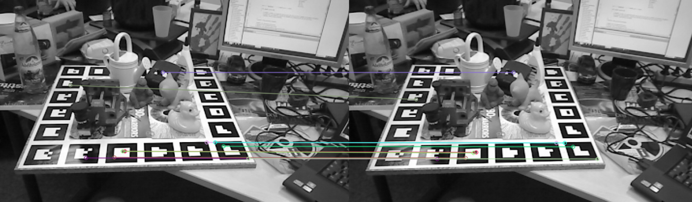

# 6D Object Pose Estimation for Robotics

## Problem
Object 6D pose estimation is a fundamental problem in computer vision and robotics.  
It aims to estimate the **3D position** and **3D orientation** of a rigid object with respect to the camera coordinate frame.

Given RGB or RGB-D images and known camera intrinsics, the task is to compute the object’s rotation and translation in 3D space.  
Accurate 6D pose estimation is essential for enabling robots to perceive and reason about objects in their surrounding environment.

---

## Why for Robotics?
In robotic manipulation tasks such as **pick-and-place** or **grasping**, a robot must know not only where an object is located, but also how it is oriented in 3D space.

2D object detection alone does not provide sufficient information for physical interaction, as it lacks:
- Depth information
- Orientation cues

Reliable 6D pose estimation allows robots to interact with objects accurately and safely in real-world environments.

---

## Approaches
This project investigates both **classical** and **learning-based** approaches for 6D object pose estimation.

- **Classical methods** rely on feature extraction and geometric algorithms such as Perspective-n-Point (PnP).
- **Learning-based methods** aim to improve robustness under occlusion and visual noise.

The performance of these approaches is evaluated on benchmark RGB-D datasets such as **LINEMOD**, with extensions to more complex datasets like **YCB-Video**.

In a classical pipeline, 3D points are obtained from the object’s CAD model in the model coordinate system, while 2D points are extracted from image keypoints.  
The PnP algorithm estimates the object pose by aligning these 3D–2D correspondences.

For RGB-only input, 2D–3D correspondences are established by matching image features to pre-rendered object templates, where each template feature is associated with a known 3D point on the CAD model.

---

## Classical Template-Based Pipeline
```text
CAD model (.ply)
   ↓
Render object from many viewpoints
   ↓
Template images + known pose
   ↓
ORB features on templates
   ↓
ORB features on test image
   ↓
Feature matching (nearest neighbour)
   ↓
2D–3D correspondences
   ↓
solvePnP

```
## Dataset Info
The dataset provides ground-truth 6D object poses in the **BOP format**.

Each pose is represented by:
- A 3×3 rotation matrix: `cam_R_m2c`
- A 3D translation vector (in millimeters): `cam_t_m2c`

The notation **m2c** denotes the transformation from the object model coordinate system to the camera coordinate system.

For the classical baseline, we adopt a **template-based matching approach**.  
This choice is motivated by:
- The availability of CAD models (`.ply` files) in the LINEMOD dataset
- The use of RGB-only images

By rendering the object model from multiple viewpoints, template images with known 3D correspondences can be generated, enabling 2D–3D matching for pose estimation.

Dataset link:  
https://bop.felk.cvut.cz/datasets/

---
## Phase 1: Feature Extraction and Matching
In this phase, we work with image pairs from the LINEMOD test set to establish reliable feature correspondences.

- **ORB** is used to detect and describe keypoints in each image.
- For feature matching, a **k-nearest neighbor (k = 2)** strategy is applied.
- **Lowe’s ratio test** is used to filter ambiguous matches:
  - The distance of the nearest neighbor must be at least **25% smaller** than that of the second-nearest neighbor.

This threshold provides a good trade-off between recall and precision, which is critical for downstream geometric pose estimation.


*ORB feature matching on a LINEMOD image pair using k-NN (k=2) and Lowe’s ratio test (0.75). The resulting correspondences are used as input to downstream geometric pose estimation (PnP).*

---

## Phase 2: Template Rendering and 2D–3D Correspondences *(Ongoing)*
In the classical pipeline, we adopt a template-based approach.

- The CAD model of the object is rendered from multiple viewpoints using known camera intrinsics and synthetic poses.
- Each rendered template provides a direct correspondence between 2D image features and 3D model points.
- During inference, features from the input image are matched to template features using nearest-neighbor search.
- 2D–3D correspondences are then used for pose estimation via **PnP**.


